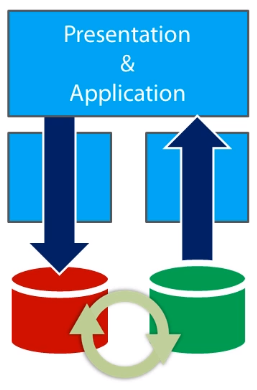

# Modern Software Architecture

## <span style="color: #3C5DD8"> The CQRS Supporting Architecture </span>

### Key Points

- CQRS Regular
- CQRS Premium
- CQRS Deluxe

All that everybody wanted was software model for the business domain.

In classic way of expressing the business through an object-oriented model, we had command and query together. <br>
In new way, which goes under the name of CQRS (Command Query Responsibility Segregation), we separate commands from queries using distinct application stacks.

### CQRS at a Glance

Two ways of designing class for a sport match.

Great for **commands**

```c#
public class Match
{
  public Match(...) { ... }

  public Score Score { get; internal set; }
  public int Period { get; internal set; }
  .
  .

  public Match Start() { ... }
  public Match Finish() { ... }
  public Match NewPeriod() { ... }
  public Match Goal() { ... }
}
```

- Requires fixes for persistence
- Exposes behavior to presentation

Great for **queries**

```c#
public class Match
{
  public Score Score { get; set; }
  public int Period { get; set; }
  public int Goal1 { get; set; }
  public int Goal2 { get; set; }
}
```

- No business rules in the class
- Risk of getting into incongruent state

**Command** is an action which:
- Alter state
- Doesn't return data

**Query** is an action which:
- Reads and returns data
- Doesn't alter state

All that CQRS is all about is that implementing the final system so that both responsibilities are distinct and have each its own implementation. <br>
Bertrand Meyer called it **Command/Query Separation** back in the 1980s.

#### Canonical Layered Architecture


#### CQRS Layered Architecture


The huge difference between these two is the implementation of the **domain** layer. <br>
In CQRS you may need to design domain model only for the command stack, and can rely on plain DTOs and direct data access in the query stack.

#### Aspects of CQRS

Why is CQRS good for architects to consider?

Benefits:
- Distinct **optimization**
- **Scalability** potential

Side effects:
- **Simplified** design
- Hassle-free stacks **enhancement**

#### Flavors of CQRS

CQRS is a concrete implementation pattern and it is probably the most appropriate for merely any type of software applications today regardless the expected lifespan and complexity.

A point that often goes unnoticed is that there is not just **one way** of doing CQRS. <br>
In particular in this course we have three different flavours:
- Regular
- Premium
- Deluxe

### CQRS Regular

#### CQRS for plain CRUD Applications

We have two distinct blocks, one for commands and data base writes, and one for queries and database reads.


If you are using EF or any other object relational mapper framework to perform data access, all you do is just duplicating the context object through which you go down the database.<br>
So you have one class library and model for commands `YourApp.CommandStack` and one for queries `YourApp.ReadStack`.

#### Command Stack

Use just the pattern that fits better.<br>
**Existing code**: If you have existing code to integrate or use, then there is a new reason to sacrifice all or part of it to the name of some domain model, you just stick to it.<br>
**Existing products**: If your company has both licenses of some product or made investments in some technology, no need to sacrifice anything to a domain model.<br>
**Existing skills**: If your developers know how to do something very well, it might not be a nice idea to force them a way and use something else, or at least you have to be a very very careful.

The business logic can be expressed in a number of ways, so you can certainly use in a CQRS even in the simplest CQRS CRUD like application, the **Domain Model** pattern. In doing so, you put your business rules right into the classes of the model. But you can likewise use other patterns such as **Table Module** or even **Transaction Script** pattern.

The end the good domain driven analysis is one thing, having a domain model is another.

#### Read Stack

Use just the code that does the job.<br>
**O/RM of choice**: ADO.NET, ODBC(Open Database Connectivity), Microframeworks, even StoredProcedures. what ever can bring the data back the way you want.<br>
**LINQ**: It can help in a sense that it can easily bring `IQueryable` objects right in the presentation layer for direct data binding.<br>
**Database in use**: Know that an `IQueryable` object describes a database query but won't execute it until you call to `List` or another nullable method.<br>

You can have high queryable objects, carry it from the bottom of the system up to presentation, and you can resolve the query right to ViewModel classes as expected from the Front-End.

> **TIP**: Use a read-only wrapper for the **DbContext** instance you use in the read stack. 
> 
> In this way when a query is performed, the presentation and application layers inly have `IQueryable` data and write actions, like those you can perform to save changes, can not just be performed.

#### Read-only Database Facade 

``` c#
public class DataBase : IDisposable
{
  private readonly QueryDbContext _db = new QueryDbContext();
  
  public IQueryable<Customer> Customers
  {
    get { return _db.Customers; }
  }
  
  public void Dispose()
  {
    _db.Dispose();
  }
}
```

### CQRS Regular in Action


- Queries
  - Presentation
  - Application
  - Read Stack
  - View Model
- Commands
  - Presentation
  - Application
  - Command Stack
  - Redirect to Read Stack (Post-Redirect-Get pattern)

```c#
// Perform the query
public RegisterViewModel GetAdminViewModel()
{
    var model = new RegisterViewModel();
    using (var db = new Database())
    {
        var list = (from m in db.Matches select m).ToList();
        model.Matches = list;
    }
    return model;
}

// Perform the command
public void Register(RegisterInputModel input)
{
    using (var db = new CommandDbContext())
    {
        var match = new Match { Id=input.Id, Team1 = input.Team1, Team2 = input.Team2 };
        db.Matches.Add(match);
        db.SaveChanges();
    }
}
```

### CQRS Premium

In a CQRS just having two distinct databases sounds like an obvious thing to do, if data manipulation and virtualization needs would require different formats.<br>
The issue becomes how to keep the two databases in sync.



#### Command Stack

The golden rule of CQRS is that you always use the patter to organizing the business logic that best fits your needs.<br>
And this is the golden rule of implementing the Command Stacks. Just the separation of commands and queries should inspire you to look at coding at command stack from a more task-oriented perspective.<br>
A command is just a statement that triggers a workflow. You can just optimize the workflow, this means Ad-hoc storage. Ad-hoc storage depending on the scenario may need something like a **relational** schema or schemaless data **NoSQL** or even in alternative or an addition a data store that logs business **events**.

|                |                    |
| -------------- | ------------------ |
| Task-oriented  | Domain Model       |
| Ad-hoc storage | Transaction Script |

#### Read Stack

Using the data access technology of choice wether an O/RM or other. As it is just about queries, LINQ helps a lot and so it is the feature that was discussed earlier.<br>
If you feel that data is preferably taking different shapes in command and query stacks, then it mostly needs that what ever is the most effective way to store data of the system for query purposes ou want to have ready made relational tables, even when a NoSQL database is optimal for commands, queries are still best served by a plain classic relational set of tables.

The issue is having distinct datastores for commands and queries makes development simpler and optimizes both operations, but at the same time it raises the problem of keeping the stores in sync; for the time in which data is not synced up, your ups serves stale data. Is this acceptable?

#### Command and Query **Storage**

The dynamics of a CQRS premium solution when two distinct datastores are used is the following. When a command executes, the command datastore is updated, the state of the system is consistently saved within any transactional boundaries you need to have. At some point in some way the state of the system must be so to speak replicated in a format that makes it suitable for the read stack.


#### Command and Query **Storage Synchronization**

There are many possible ways to keep datastores in sync  and choosing one or the other is just depends on what is best for the application.

The first approach that comes to mind is making everything **synchronous**, every command that triggered at the end just starts the sync up operation as part of it transaction.<br>
But, if synchronous is too much of a work and also represents potential stomping block for scalability o performance, then you can make the whole thing **asynchronous** and run it outside of the command transaction.<br>
If having stale data is acceptable to some extend you can also **schedule**. Synchronization as periodical job that read the command store and updates the read store.<br>
And finally the Synchronization can has laziest possible and even triggered **on-demand**, for example when a read comes that may find stale data and you don't want it to serve stale data.

- Synchronous --> Automatically up-to-date
- Asynchronous --> Eventually up-to-date
- Scheduled --> Controlled staleness
- On-demand --> Controlled up-to-date

### CQRS Premium in Action


The Server that calls to command and read stacks intern command and read stacks reference external libraries notably EF and also a shared helper library and the system infrastructure.<br>
In this example `Module5.Premium.Infrastructure.dll` refers to shared data access layer and `Module5.Premium.Shared.dll` refers to helper classes.

#### Synchronization


```c#
// Log the event and sync up
public void ProcessAction(string id, EventType whatHappened, string team1 = null, string team2 = null)
{
    switch (whatHappened)
    {
        case EventType.Undo:
            EventSourceManager.RemoveLast(id);
            break;
        case EventType.Created:
            EventSourceManager.Log(id, whatHappened, TeamId.Unknown, team1, team2);
            break;
        case EventType.Start:
            EventSourceManager.Log(id, whatHappened);
            break;
        case EventType.End:
            EventSourceManager.Log(id, whatHappened);
            break;
        case EventType.Resume:
            EventSourceManager.Log(id, whatHappened);
            break;
        case EventType.NewPeriod:
            EventSourceManager.Log(id, whatHappened);
            break;
        case EventType.EndPeriod:
            EventSourceManager.Log(id, whatHappened);
            break;
        case EventType.Goal1:
            EventSourceManager.Log(id, whatHappened, TeamId.Home, GetRandomPlayerId());
            break;
        case EventType.Goal2:
            EventSourceManager.Log(id, whatHappened, TeamId.Visitors, GetRandomPlayerId());
            break;
        case EventType.Timeout1:
            EventSourceManager.Log(id, whatHappened, TeamId.Home);
            break;
        case EventType.Timeout2:
            EventSourceManager.Log(id, whatHappened, TeamId.Visitors);
            break;
    }
    // Notify the live module of changes
    LiveScoreHub.Refresh();
}

public static void Log(string matchId, EventType eventOccurred, TeamId teamIndex, String team1 = null, String team2 = null, int? playerId = null)
{
    var matchEvent = EventBuilder.New(matchId, eventOccurred, teamIndex, team1, team2, playerId);
    EventRepository.Store(matchEvent);

    // Sync up with read model
    // 1: read all events
    // 2: play all events using Match class
    // 3: save state to relational DB for reads/live
    var match = Replay(matchId);
    MatchSynchronizer.Save(match);
    
    // or 
    // 1: do nothing  here
    // 2: expect a scheduled job do previous sync steps 
    
    // or 
    // 1: do nothing here
    // 2: expect read stack replays events via Match class when requested
}

public static Match Replay(string matchId)
{
    var allEvents = EventRepository.All(matchId);
    if (allEvents.Count == 0)
        return null;
    var match = new Match();
    foreach (var e in allEvents)
    {
        var whatHappened = (EventType) Enum.Parse(typeof (EventType), e.Action);
        switch (whatHappened)
        {
            case EventType.Created:
                match = new Match(e.MatchId, e.Team1, e.Team2);
                break;
            case EventType.Start:
                match.Start();
                break;
            case EventType.End:
                match.Finish();
                break;
            case EventType.NewPeriod:
                match.StartPeriod();
                break;
            case EventType.EndPeriod:
                match.EndPeriod();
                break;
            case EventType.Goal1:
                match.Goal(TeamId.Home);        // Should add player reference too
                break;
            case EventType.Goal2:
                match.Goal(TeamId.Visitors);    // Should add player reference too
                break;
            case EventType.Timeout1:
                match.Timeout(TeamId.Home);
                break;
            case EventType.Timeout2:
                match.Timeout(TeamId.Visitors);
                break;
            case EventType.Resume:
                match.Resume();
                break;
        }
    }
    return match;
}
```

### Message-based Business Logic

When you think about a system with distinct command and query stacks, the vision of the system becomes a lot more task-oriented.<br>
Tasks are essentially workflows, and workflows are a concatenated set of commands and events.<br>
Message base architecture is beneficial has greatly simplified management of complex business workflows. However, such a message based architecture would be nearly and possible to achieve out side the context of CQRS that keeps command and query stacks separated.

#### What is the point of messages?

A message can either be a command or an event, so in code you usually start defining a base `Message` class that defines unique `Id` for the workflow and possibly a `TimeStamp` to denote the time which the message was received.

```c#
public class Message
{
  public string SagaId { get; set; }
  public DateTime TimeStamp { get; set; }
}

public class Command : Message
{
  public string Name { get; protected set; }
}

// A Notification of what has happened
public class Event : Message
{
  // Any properties that may help retrieving and persisting events
}
```

A Command is an action performed against backend, that the user or some other system components requested.<br>
An event carries data and notifies of something that has happened.<br>
Commands and Events follow a standard of naming conventions, a command is imperative and has name like `SubmitOrderCommand`, an event instead denotes a thing of the past and is named like `OrderCreated`.

In a message based architecture you render any business task has workflow, except that instead of using an Ad-hoc framework to define workflow or plain code, you determine the progress of the workflow by sending messages.<br>
The application layer sends a message and command layer processes the message. When a message whether a command or an event is received the command stack originates a task.<br>
The task can be a long running stateful process as well as single action or stateless process. A common name for such a task is **saga**.

Commands usually don't return data back to the application layer, except perhaps for some quick form of feedbacks such as wether the operation completed successfully, was refused by the system, or the reason why it failed.

The application layer can trigger commands following user actions incoming from asynchronous streams or other events generated by the previous commands.<br>
For a message based system to work, some new infrastructure is required, **Bus** and associated set of **Listener**.

### CQRS Deluxe

It is a flavour of command query separation that relies on a messages based implementation of the business tasks.<br>
The read stack is not really different from other CQRS scenarios, but command stack takes a significantly different layout.<br>
A new way of doing all things, but a new way that is a lot more extensible and resilient to changes.

#### Command Stack

In this design the application layer doesn't call out any full fledged implementation of some workflows, but it simply turns any input it receives into a command and pushes that to a new element, the **BUS**.
The BUS is generically referring to a shared communication channel that facilitates communication between software modules. The BUS here is just a shared channel and doesn't have to be necessarily a commercial product or an open-source framework, It can also and simply be your own class.

At startup the bus is configured with a collection of listeners that is components that just know what to do with incoming messages. There are two types of message handlers:
- Saga(s)
  - It is an instance of the process that is optionally stateful maintains access to the BUS, is persistable and sometimes long running
- Handler(s)
  - It is a simpler one of executor of any code bound to a given message

As a result once a message is pushed to the BUS the resulting sequence of the actions is partially predictable and maybe altered at any time, adding and removing listeners to and from the BUS.<br>
Handlers and immediately where has sagas ,which are potentially long running, will end at some point in the future when the final message is received that ends the task that saga represents.<br>

Sagas and Handlers interact with whatever family of components exists in the command stack to expose business logic algorithms. Most likely even though not necessarily, you'll have a domain layer with a domain model and domain services according to the architecture that was in [module 4](https://github.com/SanazSadr/modern-software-architecture/blob/main/4-the-domain-model-supporting-architecture.md).<br>
The domain services specifically repositories will then interact with the data store to save the state of the system.

To use of the BUS also enables a scenario that will be discussed in the [next module](https://github.com/SanazSadr/modern-software-architecture/blob/main/6-event-sourcing.md), this is event sourcing.<br>
Event sourcing is a technic that turns detected and recorded business events into a true part of the data source of the application.<br>
When the BUS receives a command it just dispatches the message to any registered listeners, whether sagas or handlers.<br>
But when the BUS receives an event from the presentation or from other sagas, it may first optionally persist the event to the EventStore log database and then dispatch it to listeners.

#### Read Stack

The read stack uses any good query code that does the job. This means using O/RM of choice, LINQ and Ad0hoc storage mostly relational.

The issue of stale data and synchronization is still present and in the context of the CQRS deluxe solution, the code that update synchronously or asynchronously the read database, can easily take the form of a handler.

### CQRS Deluxe Implementation

CQRS deluxe has richer and more sophisticated infrastructure. The infrastructure in fact has to provide BUS capabilities and support for listeners and handlers of business logic commands and events.

#### Inside the BUS

- List of **known** saga types
- List of **running** saga instances
- List of **known** handlers

The BUS gets the messages and only does its dispatching messages to sagas and handlers, each saga and handler in fact will declare which messages they're interested in; and in this regard the overall work of the BUS is fairly simple.

#### Inside the SAGA

A saga is characterized in two core aspects:
- Command or event that starts the associated business process
- List of commands and events the saga can handle

```c#
public class CheckoutSaga : Saga<CheckoutSagaData>,
        IStartWith<StartCheckoutCommand>,
        ICanHandle<CancelCheckoutCommand>,
        ICanHandle<PaymentCompleteEvent>,
        ICanHandle<PaymentDeniedEvent>,
        ICanHandle<DeliveryRequestRefusedEvent>,
        ICanHandle<DeliveryRequestApprovedEvent>
{
  public void Handle(StartCheckoutCommand message)
  {
    ...
  }

  ...
}
```

Each saga is mostly identified by a unique ID
- Can be a GUID
- Can be the ID of the aggregate the saga is all about
- Can be a combination of values that is unique in the context

A saga might be stateful and needing persistence
- Persistence is care of the bus
- State of the associated aggregate must be persisted

A saga might be in some cases stateless
- Mere task executor getting any data from the start command

#### Extending a Solution

Got a new handling scenario for an existing event?<br>
Got a new handling scenario for a new feature?

**Write** a new saga or handler and **register** it with the bus. That's it.<br>
You don't need to touch the existing workflows and the existing code.

#### More About the BUS

- Can write your own bus
  - Mostly about real traffic hitting the application
  - Plug in some queue engine
  - Plug in some persistence mechanism
- Look into existing products and frameworks
  - **NServiceBus** from [Particular software](https://particular.net/nservicebus)
  - **Rebus** from [Rebus-org](https://github.com/rebus-org/Rebus)
  - **MassTransit** from [Pandora](https://masstransit-project.com)

### CQRS Deluxe Code Inspection

Everything starts from a request that hits the Controller.

```c#
public class BookingController : Controller
{
    private readonly BookingService _service = new BookingService();

    [HttpPost]
    public ActionResult Add(int courtId, int length, int hour, string name)
    {
        _service.AddBooking(courtId, hour, length, name);
        return RedirectToAction("index", "home");
    }
}
```

```c#
public class BookingService
{
    public void AddBooking(int courtId, int hour, int length, string name)
    {
        // Place the command to the bus
        var command = new RequestBookingCommand(
            courtId,
            hour,
            length,
            name
            );
        BookingApplication.Bus.Send(command);
    }
}
```

```c#
public class InMemoryBus : IBus
{
    public IEventStore EventStore { get; private set; }
    private static readonly IDictionary<Type, Type> RegisteredSagas = new Dictionary<Type, Type>();
    private static readonly IList<Type> RegisteredHandlers = new List<Type>();
    
    public InMemoryBus(IEventStore eventStore)
    {
        //if (eventStore == null)
        //{
        //    throw new ArgumentNullException("eventStore");
        //}
        EventStore = eventStore;
    }
    
    #region IBus
    void IBus.RegisterSaga<T>()  
    {
        var sagaType = typeof(T);
        if (sagaType.GetInterfaces().Count(i => i.Name.StartsWith(typeof(IStartWithMessage<>).Name)) != 1)
        {
            throw new InvalidOperationException("The specified saga must implement the IStartWithMessage<T> interface.");
        }
        var messageType = sagaType.
            GetInterfaces().First(i => i.Name.StartsWith(typeof(IStartWithMessage<>).Name)).
            GenericTypeArguments.
            First();
        RegisteredSagas.Add(messageType, sagaType);
    }

    void IBus.RegisterHandler<T>()
    {
        RegisteredHandlers.Add(typeof(T));
    }

    void IBus.Send<T>(T message)
    {
        SendInternal(message);
    }

    void IBus.RaiseEvent<T>(T theEvent)  
    {
        if (EventStore != null)
            EventStore.Save(theEvent);
        SendInternal(theEvent);
    }
    #endregion

    #region Private Members
    private void SendInternal<T>(T message) where T : Message
    {
        LaunchSagasThatStartWithMessage(message);
        DeliverMessageToRunningSagas(message);
        DeliverMessageToRegisteredHandlers(message);
        // Saga and handlers are similar things. Handlers are  one-off event handlers
        // whereas saga may be persisted and survive sessions, wait for more messages and so forth.
        // Saga are mostly complex workflows; handlers are plain one-off event handlers.
    }

    private void LaunchSagasThatStartWithMessage<T>(T message) where T : Message
    {
        var messageType = message.GetType();
        var openInterface = typeof(IStartWithMessage<>);
        var closedInterface = openInterface.MakeGenericType(messageType);
        var sagasToLaunch = from s in RegisteredSagas.Values
                             where closedInterface.IsAssignableFrom(s)
                             select s;
        foreach (var s in sagasToLaunch)
        {
            dynamic sagaInstance = Activator.CreateInstance(s, this, EventStore);
            sagaInstance.Handle(message);
        }
    }

    private void DeliverMessageToRunningSagas<T>(T message) where T : Message
    {
        var messageType = message.GetType();
        var openInterface = typeof(IHandleMessage<>);
        var closedInterface = openInterface.MakeGenericType(messageType);
        var sagasToNotify = from s in RegisteredSagas.Values
                            where closedInterface.IsAssignableFrom(s)
                            select s;
        foreach (var s in sagasToNotify)
        {
            dynamic sagaInstance = Activator.CreateInstance(s, this, EventStore);
            sagaInstance.Handle(message);
        }
    }
    
    private void DeliverMessageToRegisteredHandlers<T>(T message) where T : Message
    {
        var messageType = message.GetType();
        var openInterface = typeof(IHandleMessage<>);
        var closedInterface = openInterface.MakeGenericType(messageType);
        var handlersToNotify = from h in RegisteredHandlers
                               where closedInterface.IsAssignableFrom(h)
                               select h;
        foreach (var h in handlersToNotify)
        {
            dynamic sagaInstance = Activator.CreateInstance(h, EventStore);     // default ctor is enough
            sagaInstance.Handle(message);
        }
    }
    #endregion
}
```

```c#
public class BookingSaga : Saga,
        IStartWithMessage<RequestBookingCommand>
{
    private readonly IRepository _repository;

    public BookingSaga(IBus bus, IEventStore eventStore)
        : base(bus, eventStore)
    {
        _repository = new BookingRepository();
    }

    public BookingSaga(IBus bus, IEventStore eventStore, IRepository repository)
        : base(bus, eventStore)
    {
        _repository = repository;
    }
    
    public void Handle(RequestBookingCommand message)
    {
        var request = BookingRequest.Factory.Create(message.CourtId, message.Hour, message.Length, message.UserName);
        var response = _repository.CreateBookingFromRequest(request);
        if (!response.Success)
        {
            var rejected = new BookingRequestRejectedEvent(request.Id, response.Description);
            Bus.RaiseEvent(rejected);
            return;
        }
        var created = new BookingCreatedEvent(request.Id, response.AggregateId);
        Bus.RaiseEvent(created);
    }
}
```