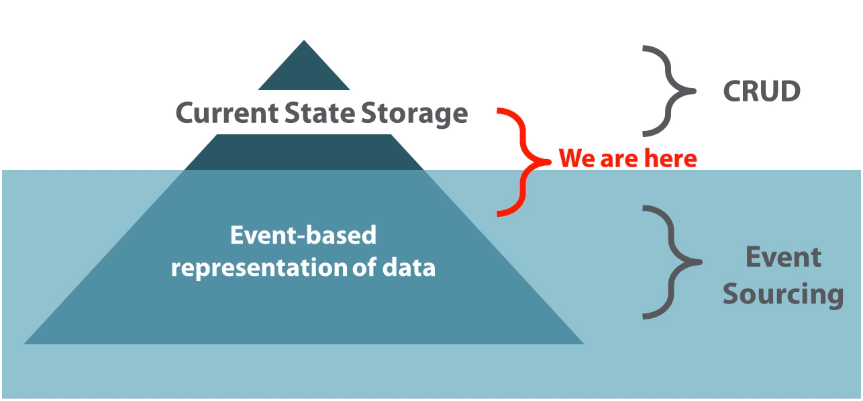
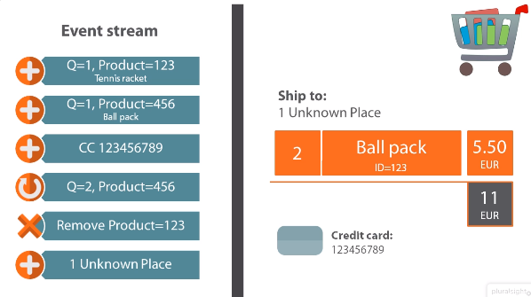
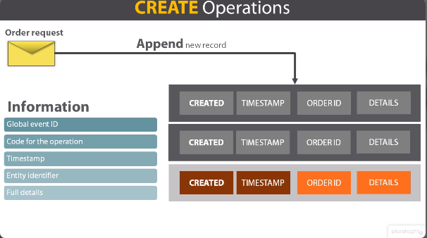
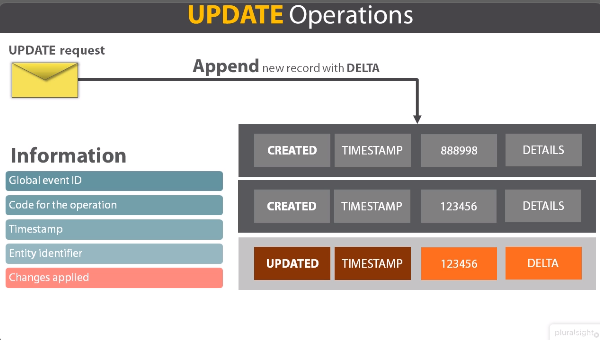
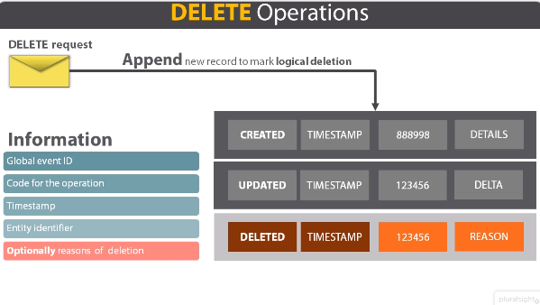
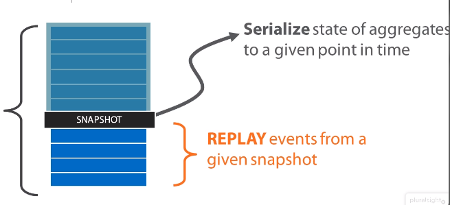

# Modern Software Architecture

## <span style="color: #3C5DD8"> Event Sourcing </span>

### Key Points

- Events
- Events as **Data Source**
- Build **Projections** of event data

Events are the concept that is empowering software beyond imagination, event plain CRUD systems and common applications are going to be touched.

In the real world you observe events. We see events after facts. Events are actually like notifications of thing that just happened.<br>
In software, you tend to write models. Events may bring some benefits to software architecture.
- Events are **Immutable** pieces of information
- By tracking events, you never miss a thing that happens in and around the business domain
- Events can be replayed and by replaying events you can process their content

### From CQRS to Events

In [module 5](https://github.com/SanazSadr/modern-software-architecture/blob/main/5-the-CQRS-supporting-architecture.md) the focus was more on the use of messages and events to implement business workflows triggered by commands. In that context, events were just crossed handler notifications of things just happened, for handlers to possibly react.

CQRS **-->** Models to persist **-->** Events to log **-->** Deep impact on system architecture

Think that you have a CRUD system and now your customer needs to know the state of the system at a given time for analysis and business intelligence.<br>
You may or may not be able to extract just that information with canonical and common techniques. Event are just a more powerful approach.<br>
Events are not just for complex applications and scenarios, they are also for the common application.

It's not that you don't need event. You just don't need events <span style="color: yellow">**yet**</span>.

Think that you have an invoice which include extra VAT taxes. Most of the time the VAT is fixed and can be event as configuration. In some cases the VAT is not flat and varies per category of goods.<br>
In some case the percentage of the VAT of a given invoice must be injected in the invoice itself. But what is going to tell you the right value for specific good?<br>
It seems to be a great job for the domain service, but still a domain service needs to read the details from persistent store and the store must be updated as taxes change.

Let's say that you have a database for this. What is the content? How would you organize tables?<br>
- Having one record for each category of goods with a column that indicates the current VAT.
  - If the VAT changes, the record is updated.
  - Once an invoice is issued, the actual VAT value should be stored.
- You have one record for each known change of VAT for any category of goods
  - You keep track that the VAT was X in a given time frame and Y in another time frame
  - In this way your database has a lot more information, this extra info makes the entire system a lot more extensible

### Event Sourcing at a Glance

Event sourcing is a design approach based on the assumption that all changes made to the application state during the entire lifetime of the application are stored as a sequence of events.<br>
Event sourcing can be summarized by saying that we end up hailing serialized events has a data building blocks of the application. Serialized event are actually the data source of the application.

> **This is not how the vast majority of applications work today.**<br>
> Most applications today, work by storing the current state of the domain entities and use that stored states to process business transactions.

#### Example

Let's say you have a shopping cart. How would you model it?
- First Model would be **Structural** representation:
   1. Add list of ordered products
   2. Payment information (exp: Credit Card details)
   3. Shipping information (exp: address details)
- Second model would be **Event** representation:
   1. Add item #1
   2. Add item #2
   3. Add payment info
   4. Update item #2 (change quantity or type)
   5. Remove item #1
   6. Add shipping info

In the second way instead of storing all the pieces of information in the columns of a single record or in the properties of a single object, you can describe the state of the shopping cart throw the sequence of events that brought it to contain a given list of items.<br>
All the given events are related to the same shopping cart entity but we don't save them in any place that current state of the shopping, but just the steps and related data that brought it to be what it is actually under arise.

In most application like CRUD application, they store their current state via snapshot so they just store the current state and they ignore events.<br>
On top of an event based representation of data, you can still create has snapshot database that current state representation that returns the last known good state of domain entity.



#### key facts of **Event Sourcing**

- An event is something that has happened in the past
- Events are expressions of the ubiquitous language
- Events are not imperative and are named using past tense verbs (like *OrderCreated* not *PlaceOrder*)
- Have persistent store for events (Ad-hoc relational table, NoSQL store or any event store products)
- Append-only, no delete
- Replay the (related) events to get to the last known state of an entity
  - Replay from the beginning or a known point (**snapshot**)

#### An Event is something that happened in the past

This is a very important point about events and should be kept clearly in mind.
- Once stored, events are immutable
  - Can be duplicated and replicated (for scalability reasons)
- Any behavior associated with the event has been performed
  - Replaying the event doesn't require to repeat the behavior
- You don't miss a thing
  - Track everything that happened in the time it happened
  - Regardless of the effects ir produced

> **NOTE:** Data saved at a lower abstraction level

### Event as the Data Source

#### CQRS and Events

**CQRS** is the dawn of a new software design experience. **Events** are what you find when the dawn has actually turned into a brans new day.

A some point relational databases have become the center of the universe as far as the software design is concerned. They brought uo the idea of the data model and persistence of the data model. It worked, and still works.<br>
It's about time to reconsider this approach because chances are that it shows incapable of letting you achieve some results getting more and more important in coming days. There is no automatic action here.
It's just warm suggestions to look beyond state and look in the direction of events.<br>
Events are a revolutionary new approach to software design and architecture, except that events are not really new, and not really revolutionary.<br>
Relational databases themselves don't manage current state internally, even though they expose current state outside. But internally relational databases work looking at the actual actions that modify the initial state.

**Events** may be the token stored in the application data source in nearly every business scenario. It's just that something a current state classic approach is functional as well as more comfortable to implement.
Events just go at the root of the problem and often a more general storage solution for just every system.

You have two options to build your application:
- First
  1. Store current state
  2. Use events to log relevant facts
- Second
  1. Store events
  2. Build relevant snapshots of facts

What it means to store events?



**Is it important** to track <span style="color: red">**what**</span> was added and then removed?<br>
**Is it important** to track <span style="color: red">**when**</span> an item was removed from cart?<br>
If the answer is **yes**, you probably need **events**.

- Commands --> **Event** stream
- Queries --> **Orders** table

As an architect you only have to decide whether you want to have a command stack based on an event stream that work in sync with orders table, or more conservatively you want to start with orders tables and then just record an event stream separately for any relevant fact.

> Be aware that moving from a current state solution to a full event store scenario, may require significant refactoring.

### Event-based Persistence

In software persistence is made of 4 key operations:
- Create (Alter the state)
- Update (Alter the state)
- Delete (Alter the state)
- Queries (Read the state without altering)

#### Create Operation

There is a request coming from the presentation layer or some other asynchronous way, the command stack processes that and appends a new record with all the details.<br>
The existing datastore is extended with new item that contains all information needs to be immutable. If VAT information is required, the current raid is better stored inside the log information and not read dynamically from else where.



#### Update Operation

Update is a different operation from create as you don't overwrite an existing record, but just add another record that contains DELTA.<br>
If you only updated the quantity of a given product in a given order, you only store the new quantity and product ID.



> In some cases, you might want to consider storing <span style="color: yellow">**the full state of the entity**</span> along with the specific event information.

#### Delete Operation

Physical record deletion of event in case of UNDO functionality?<br>
**DO NOT DELETE** in the middle of the stream.



### Data Projections from Stored Events

#### Query Operation

Tha main aspect of event sourcing is a persistence of messages which enables you to keep track of all changes in the state of the application.<br>
Recording individual events doesn't give you immediate notion of the state of the various aggregates.<br>
By reading back the log of messages, you build the state of the system and at that point you get to know the state of the system.<br>
This aspect is what is commonly called **the replay of events**.

Replay is a two step operation:
1. **Grab all events** by entity Id
2. **Replay through** all events, and extract information from events and copy that information to a fresh instance of the aggregate of choice

#### Replay of Events

A key function that one expects out of an event based datastore is the ability to return the full or partial stream of events. This function is necessary to rebuild the state of an aggregate out of recorded events.

```c#
// RavenDB query example
public IEnumerable<GenericEventWrapper> GetEventStream(string id)
{
    return DocumentSession
            .Query<GenericEventWrapper>()
            .Where(t => t.AggregateId == id)
            .OrderBy(t => t.TimeStamp)
            .ToList();
}
```

> **NOTE:** You can code the same also using a relational database.

The structure of a **generic event wrapper class** depends on the application may be different or in some way constraint if you are using some Ad-hoc tools for event sourcing.<br>
In general terms an **event class** can be any thing like the following code:

```c#
public class GenericEventWrapper
{
    public string EventId { get; set; }
    public string EventOperationCode { get; set; }
    public DateTime TimeStamp { get; set; }
    public string AggregateId { get; set; }
    public DomainEvent Data { get; set; }
}
```

The actual rebuilding of the state consists in going through all events, grab information and then altering state of the fresh new instance of the aggregate of choice.<br>
What you wanna do is storing in the fresh instance of the aggregate, the current state has in the system or the state that results from the selected stream of events.<br>
The way you update the state of the aggregate depends on the actual interface exposed by the aggregate itself, whether it's a domain class or relies on domain services for manipulation.

```c#
public static Aggregate PlayEvents(string id, IEnumerable<DomainEvent> events)
{
    var aggregate = new Aggregate(id);
    foreach(var e in events)
    {
        if(e is AggregateCreatedEvent)
            aggregate.Create(e.Data);
        
        if(e is AggregateUpdatedEvent)
            aggregate.Update(e.Data);
        
        if(e is AggregateDeletedEvent)
            aggregate.Delete(e.Data);
    }
    return aggregate;
}
```

There are a few thing to mention in event replay:

- Replay is not about repeating commands that generated events. 
  - Commands are potentially long running operations with concrete affects that generate event data.
  - Replay is just about looking into this data and perform logic to extract information from this data.
- Effects of occurred events applied to fresh instances.
- Effects may be redefined in each application.

Events are data rendered at a lower abstraction level than plain state. From events you can rebuild any projection of data you like including the current state of aggregates which is just one possible way of projecting data. Ad-hoc projections can address other more interesting scenarios like business intelligence, statistical analysis and simulation.

More specifically, let's say that you have stream of events. You can extract specific subset whether by date or type or anything else. Once you got selected events, you can replay them and apply ad-hoc calculations and business processes and extract just the custom new information you were looking for.

Another great point about events and replay of events is that streams are constant data and because of that they can be replicated easily and effectively for example to enhance scalability potential of the application. This is actually a very very pleasant side affects of events immutability.

Should you have **performance** concerns? What if you get to process too many events for rebuilding the desired projection of data?

To cut the long story short, projecting state from logged events might be heavy handed and impractical with very large number of events and the number of logged events in any application can be grown by time because it's an append only store.

In many cases however replay only involves just a handful of events but there is not a general rule. so what is the work around when you get to process in replay too many events?<br>
Effective work around consists of saving snapshot of the aggregate state or whatever business entities you use at some recent point in time instead of processing the entire stream of events, you serialize the state of aggregates at a given pointing time and save that as a value. Next, you keep track of the snapshot point and replay events for an aggregate from the latest snapshot to the point of interest.



### Event Sourcing in Action

This should be explained by code!

### Event-based Data Stores

You can definitely arrange an event sourcing solution all by yourself.<br>
But to store events effectively ad-hoc tools may be better.

#### [Event Store](http://geteventstore.com) Operations

It works by offering an Api for playing http and .net, and the api is for event streams. In the age of event store and aggregate, equates the stream in the store. No concerns about the ability of the event-store database to manage and store potentially millions of events group by aggregates. This is not your concern, the tool is able to work with these numbers.

- Write events
- Read events
  - the last event
  - specific event by id
  - slice of events
- Subscribe to stream to get updates

```json
[
    {
        "eventId": "UUID",
        "eventType": "OrderCreatedEvent",
        "data": { "orderId": "1", ... }
    }
]
```

#### Event Store Types of Subscriptions

- Volatile
  - A call back function is invoked whenever an event is written to a given stream, you get notifications from this subscription until it is stopped
- Catch-up
  - You will get notifications from a given event specific by position up to the current end up stream, so give me all events from this moment onward, once the end of the stream has been reached the catch-up subscription turns into a volatile and you keep on getting any new event added to the stream
- Persistent
  - When multiple consumers are waiting for events to process, the subscription guarantees that events are delivered to customers at least once, but possibly multiple times and if this happens the order is unpredictable. 
  - This Solution is specially designed for high scalable systems, collaborative systems and to be effective it requires software design that supports the notion of idempotency

In particular, the **Catch-up** subscriptions are good for components called "denormalizers" which play a key role in a CQRS. In CQRS denormalizers just refer to those components that create projection of data for the query stack.
